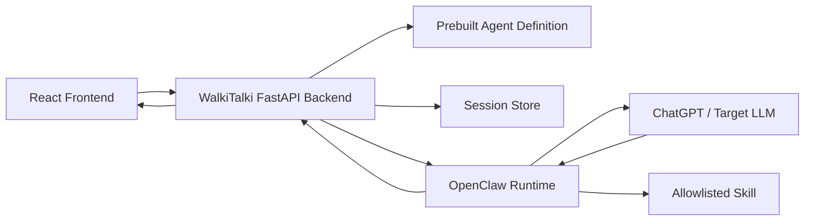

# OpenClaw MVP Architecture

## Table of Contents

- [Purpose](#purpose)
- [Architecture Summary](#architecture-summary)
- [System Boundaries](#system-boundaries)
- [Frontend Architecture](#frontend-architecture)
- [Backend Architecture](#backend-architecture)
- [OpenClaw Runtime Boundary](#openclaw-runtime-boundary)
- [Example Agent Definition](#example-agent-definition)
- [Session Model](#session-model)
- [API Shape](#api-shape)
- [Runtime Flows](#runtime-flows)
- [Error Handling](#error-handling)
- [Security Rules](#security-rules)
- [What Does Not Exist Yet](#what-does-not-exist-yet)
- [Implementation Order](#implementation-order)

## Purpose

This document describes the frontend and backend architecture for the OpenClaw
MVP validation.

The goal is to prove one runtime path:

1. A user opens a prebuilt photo-language agent.
2. The user starts a session.
3. The user logs in with ChatGPT/provider auth through OpenClaw.
4. The user optionally adds session-only custom instructions.
5. The user uploads a photo.
6. The target LLM returns a language lesson.
7. The same session supports follow-up chat and one allowlisted skill.

This architecture intentionally excludes agent creation, editing, publishing,
marketplace behavior, WalkiTalki accounts, pasted API keys, flashcards, memory,
vector stores, audio, scripts, and external API integrations.

## Architecture Summary

React never talks directly to OpenClaw.

The backend owns the example agent definition, session state, browser-session
isolation, and all communication with OpenClaw.

OpenClaw owns provider login, authenticated runtime execution, image routing to
the target LLM, skill loading, and runtime metadata.

## System Boundaries

### React Frontend

React is a thin runtime client.

It displays the example agent, collects optional session instructions, starts
login, uploads images, shows chat, and renders runtime status.

It does not create, edit, publish, or store agent specs.

### FastAPI Backend

The backend is the application boundary.

It serves the prebuilt agent, creates OpenClaw sessions, stores local session
references, proxies runtime messages, handles image upload, and normalizes
OpenClaw errors for the frontend.

It does not store provider API keys or provider refresh tokens.

### OpenClaw

OpenClaw is the runtime boundary.

It manages ChatGPT/provider login, binds authenticated provider context to a
runtime session, calls the target LLM, routes image input, loads the allowlisted
skill, and returns assistant output.

### Target LLM

The target LLM performs vision understanding, lesson generation, and follow-up
chat.

WalkiTalki should treat the model as accessed through OpenClaw, not directly
from React.

## Frontend Architecture

### Route

Add one route for the validation experience:

- `/openclaw`

This page is the entire OpenClaw MVP frontend.

### Page Responsibilities

The page should support:

- Loading the example agent summary
- Displaying provider/runtime status
- Accepting optional session custom instructions before session start
- Starting the OpenClaw runtime session
- Sending the user through ChatGPT/provider login if required
- Uploading one image
- Displaying assistant responses as markdown
- Sending follow-up text messages
- Showing skill validation result
- Showing clear runtime errors

### Frontend State

Suggested page state:

- `agent`: example agent summary
- `session`: current runtime session summary
- `customInstructions`: optional session-only text
- `messages`: chat messages returned by the backend
- `selectedImage`: image selected for upload
- `runtimeStatus`: idle, starting, login_required, authenticating, ready,
  sending, error
- `providerStatus`: unknown, disconnected, login_required, connected, expired
- `skillStatus`: unknown, available, invoked, failed
- `error`: normalized user-facing error

### UI Sections

The page can be simple:

- Agent header
- Runtime/provider status strip
- Optional custom instructions textarea
- Start Chat or Continue Login button
- Image upload control
- Chat transcript
- Chat input
- Skill validation control or status
- Error banner

The custom instructions field should lock after the runtime session starts, or
the frontend should clearly state that changes apply only to a new session.

### Frontend Non-Goals

Do not add:

- Agent builder
- Agent edit form
- Publish button
- Agent list
- Marketplace UI
- Account settings
- API key form
- Skill picker
- Provider picker

## Backend Architecture

### Backend Modules

Suggested modules:

- `api/openclaw_agent.py`: routes for the validation page
- `services/example_agent.py`: prebuilt agent definition
- `services/openclaw_client.py`: OpenClaw integration boundary
- `services/openclaw_sessions.py`: local session tracking
- `schemas/openclaw.py`: request and response models

### Example Agent Service

The backend should expose one static agent definition.

The definition can live in code or a checked-in JSON file. It should not be
editable through the API.

It should include:

- Stable agent ID
- Name
- Description
- Target language
- Optional native language
- Fixed system instructions
- Target model/provider requirement, if known
- Required image capability
- Required ChatGPT/provider login
- Allowed validation skill ID
- Skill source metadata

### OpenClaw Client

The OpenClaw client should be the only code that knows OpenClaw request shapes.

It should expose application-level methods:

- `create_session(agent, custom_instructions)`
- `get_login_status(session_ref)`
- `get_login_url(session_ref)`
- `confirm_login(session_ref)`
- `send_text(session_ref, message)`
- `send_image_lesson(session_ref, image, prompt)`
- `invoke_validation_skill(session_ref)`

These names are conceptual. The actual methods should follow OpenClaw's API once
validated.

### Session Service

The session service maps a browser session to an OpenClaw runtime session.

It should track:

- Browser session ID
- OpenClaw session reference
- Example agent ID
- Runtime status
- Provider status
- Whether custom instructions were provided
- Last known model/provider metadata
- Skill status
- Created and updated timestamps

For the validation MVP, an in-memory store is acceptable if the app is running
locally. If multiple backend workers or restarts matter, use PostgreSQL.

## OpenClaw Runtime Boundary

All runtime operations go through the backend.

OpenClaw must be treated as an external runtime service with uncertain behavior
until validated. The backend should normalize responses into WalkiTalki concepts
instead of leaking raw OpenClaw shapes into React.

Required OpenClaw capabilities:

- Backend-created runtime session
- ChatGPT/provider login initiation
- Login completion confirmation
- Authenticated target LLM calls
- Image upload or forwarding to the same target LLM used for chat
- Session-only custom instructions
- One reviewed external skill
- Per-agent skill allowlisting
- Runtime metadata and errors

## Example Agent Definition

Initial example agent:

- ID: `photo-language-openclaw-demo`
- Name: `Photo Language Tutor`
- Target language: configurable in code, default Spanish
- Native language: English
- Purpose: create a short language lesson from an uploaded photo
- Skill: one reviewed instruction-only lesson-formatting skill

Baseline behavior:

- Identify visible objects in the image.
- Name the objects in the target language.
- Define the words in plain English.
- Provide a few practical phrases.
- Ask one follow-up practice question.
- Answer follow-up questions using the same image and lesson context.

Session custom instructions may change tone or emphasis, but not the agent's
core capability or security boundaries.

## Session Model

The MVP has no WalkiTalki user accounts.

Use a browser session identifier to isolate runtime sessions.

Session rules:

- One browser session can have one active OpenClaw session for the demo agent.
- A second browser session must receive a separate OpenClaw session.
- Provider auth must not be shared across browser sessions unless OpenClaw
  explicitly proves it is the same user's own authenticated provider profile.
- Uploaded images, chat messages, custom instructions, and skill state are
  session-scoped.
- Ending or resetting the session should drop the local OpenClaw session
  reference.

## API Shape

The final route names can change, but the architecture should support these
operations.

### Get Example Agent

`GET /api/openclaw/agent`

Returns the static example agent summary and current browser-session runtime
status, if one exists.

### Start Runtime Session

`POST /api/openclaw/session`

Request:

- Optional custom instructions

Response:

- Runtime session ID or local session reference
- Runtime status
- Provider status
- Login URL, if login is required
- Model/provider metadata, if available

### Confirm Login

`POST /api/openclaw/session/confirm-login`

Confirms with OpenClaw that the provider login completed and returns updated
runtime status.

### Send Text Message

`POST /api/openclaw/chat`

Request:

- Text message

Response:

- Assistant message
- Runtime status
- Usage metadata, if available

### Send Image Lesson

`POST /api/openclaw/image-lesson`

Request:

- Image file
- Optional prompt override

Response:

- Assistant lesson message
- Image upload status
- Model/provider metadata
- Usage metadata, if available

### Invoke Validation Skill

`POST /api/openclaw/skill-validation`

Triggers the allowlisted validation skill and returns either skill metadata or
assistant output that proves skill-dependent behavior.

### Reset Session

`POST /api/openclaw/session/reset`

Drops the local runtime session reference and returns the page to idle state.

## Runtime Flows

### Start and Login

1. Frontend loads `/api/openclaw/agent`.
2. User enters optional custom instructions.
3. Frontend calls `POST /api/openclaw/session`.
4. Backend creates OpenClaw session.
5. Backend returns ready or login-required state.
6. If login is required, frontend opens the login URL.
7. Frontend calls confirm-login after redirect or user action.
8. Backend confirms with OpenClaw and returns ready state.

### Image Lesson

1. User uploads an image.
2. Frontend sends image to backend.
3. Backend forwards image to OpenClaw with the session reference.
4. OpenClaw routes the image to the target LLM.
5. Target LLM returns a lesson grounded in visible objects.
6. Backend stores or returns the assistant message.
7. Frontend renders the lesson in chat.

### Follow-Up Chat

1. User sends a text message.
2. Backend forwards the message to the same OpenClaw session.
3. OpenClaw calls the target LLM with session context.
4. Frontend renders the assistant response.

### Skill Validation

1. User or frontend triggers skill validation.
2. Backend sends a prompt designed to invoke the allowlisted skill.
3. OpenClaw loads or uses the skill.
4. Backend receives skill-use evidence or skill-shaped assistant output.
5. Frontend displays validation status.

## Error Handling

Normalize OpenClaw and provider failures into stable frontend categories:

- `login_required`
- `login_cancelled`
- `login_expired`
- `provider_no_access`
- `runtime_unavailable`
- `image_unsupported`
- `image_too_large`
- `skill_unavailable`
- `skill_blocked`
- `model_error`
- `unknown_error`

Each error should include:

- User-facing message
- Optional retry action
- Debug message for local development
- Whether starting a new session may help

## Security Rules

- Do not accept pasted provider API keys.
- Do not store provider API keys.
- Do not store provider refresh tokens in WalkiTalki unless a later security
  spec explicitly approves it.
- Do not expose OpenClaw raw credentials or auth artifacts to React.
- Do not allow the frontend to choose arbitrary skills.
- Do not allow the frontend to edit the example agent definition.
- Do not run unreviewed skills.
- Do not use skills that require shell execution, browser control, private data
  access, credentials, or external writes.
- Treat uploaded images as session-scoped validation data.
- Keep session custom instructions scoped to one runtime session.

## What Does Not Exist Yet

This architecture deliberately excludes:

- Agent builder
- Agent editing
- Agent publishing
- Agent list or marketplace
- WalkiTalki user accounts
- Persistent personal data
- Flashcards
- Memory
- Vector stores
- Uploaded document knowledge sources
- Audio or microphone access
- OpenAPI tool import
- Third-party API actions
- Arbitrary scripts
- Multi-provider picker UI

## Implementation Order

1. Add backend example agent definition.
2. Add backend OpenClaw client wrapper.
3. Add local session tracking.
4. Add API routes for agent, session start, login confirmation, chat, image
   lesson, skill validation, and reset.
5. Add React `/openclaw` page.
6. Add frontend runtime state and API hooks using plain fetch.
7. Add optional custom instructions before session start.
8. Add ChatGPT/provider login UI state.
9. Add image upload and lesson rendering.
10. Add follow-up chat.
11. Add skill validation trigger and status.
12. Verify second browser session isolation.
